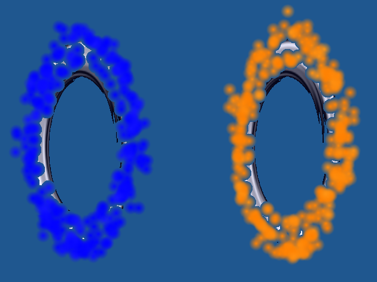

# Overview/Introduction

Welcome to my brief demonstration on what I've done for my final project in CSC 471, Winter 2024. 

I've done a project here on the idea of Portals, from the hit game Portal made by Valve Software. I wanted 
to recreate the look and feel of the portals as much as I could within the given time limits.

My project requirements that I wanted to hit include:
- Recreate the shimmering particle blue/orange particle effect on the border of the portal
- Recreate the "look-through" effect of the portals
- Create the physics/collision effects of going through portals 
- Create a level showing off these portal effects

Looking back at this, this was way, way too much to ask for in a week. But I did get some things done...

# Results

While I didn't get my final project working in time up to how I wanted to, I'm really proud as to how organized and 
readible my code is. Feel free to look around the classes I've made on this webpage to see how I organized things like 
the `MatrixStack`, as well as shaders and whatnot. 

Furthermore, as shown above, I've gotten particles working! Specifically, I've helped developed a particle-field definition for 
what forces particles experience relative to some origin. 

Lastly, I've gotten FBO's, developed for use for the rendered textures on top of the portals, implemented, but not working. This
was the thing that broke my program, as I had extreme difficulties importing a known working version of FBOs into my 
"classified" graphics program. 

A final demo recording of the project is shown below:

[Demo Video](https://youtu.be/C36byGD5ZLc)

# More References

I took notes on what references I used to begin looking at ideas for this project. If you're curious, I would 
recommend taking a look at my notes page on:

https://obsidian-school-notes.vercel.app/year3/winter2024/csc-471-comp-graphics/final-project-sketch/